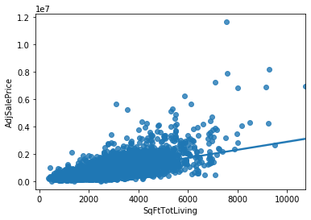

```python
import pandas as pd
import numpy as np
import matplotlib.pyplot as plt
from sklearn.linear_model import LinearRegression
import seaborn as sbs 
print("Ready")
#importing necessary libraries
#printing to check for errors
```

    Ready
    


```python
House_Sales=pd.read_csv(r'C:\Users\nmill\OneDrive\Documents\Python_work\house_sales_project.csv')

House_Sales.head()
print("Ready")

#import data and give it a handle
#inspect imported data
#print to check for errors
```

    Ready
    


```python
Adprice = House_Sales.AdjSalePrice
SqFt = House_Sales.SqFtLot
SqFtLiv = House_Sales.SqFtTotLiving
BathR = House_Sales.Bathrooms
Bedr = House_Sales.Bedrooms
BLD_Grad = House_Sales.BldgGrade
YrB = House_Sales.YrBuilt
YrReno = House_Sales.YrRenovated
TnOise = House_Sales.TrafficNoise
LvAl = House_Sales.LandVal
ImpVal = House_Sales.ImpsVal
Zip = House_Sales.ZipCode

#establishing handles for features 
```


```python
x = np.array([SqFtLiv]).reshape(-1,1)
y = np.array([Adprice]).reshape(-1,1)

model = LinearRegression().fit(x,y)
r_sq = model.score(x,y)

#shapping arrays to prep for regression and r^2
```


```python
print('coefficient of determination:', r_sq)

#r_sq suggests 50% of Adprice can be explained by SqFtLiv
```

    coefficient of determination: 0.4832798342743741
    


```python
xNew = [[2500]]
yNew = model.predict(xNew)
monetary_value = float(yNew)
currency = "${:,.2f}".format(monetary_value)
print(currency)
#Shows predicted price based on liveable sqft estimation above
```

    $688,326.79
    


```python
sns.regplot(SqFtLiv, Adprice, data=House_Sales)
```


    <matplotlib.axes._subplots.AxesSubplot at 0x1e7cc087e48>




